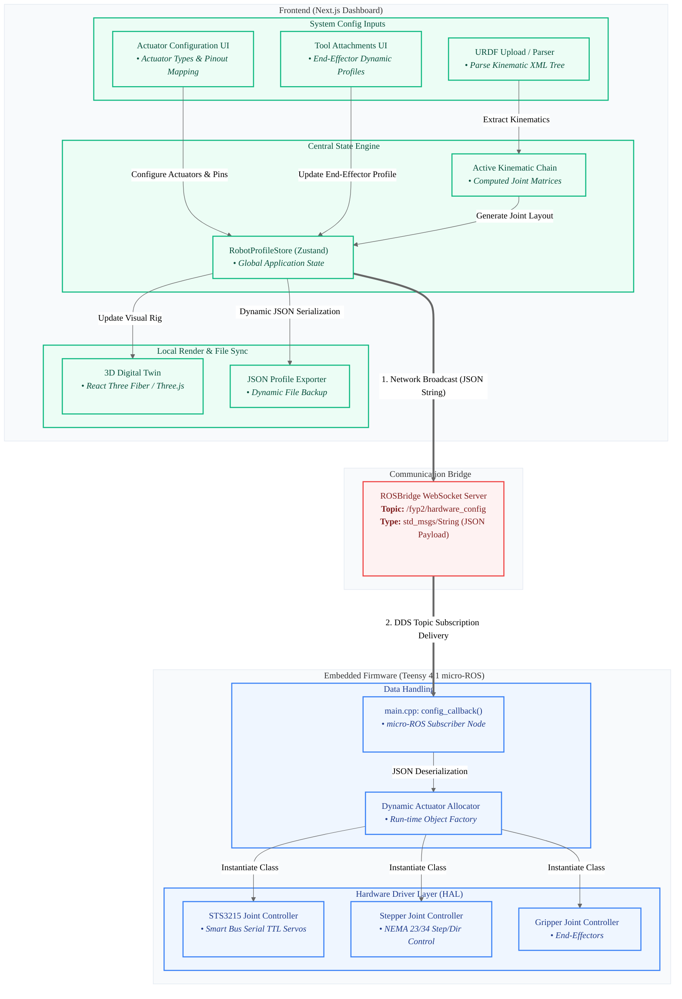
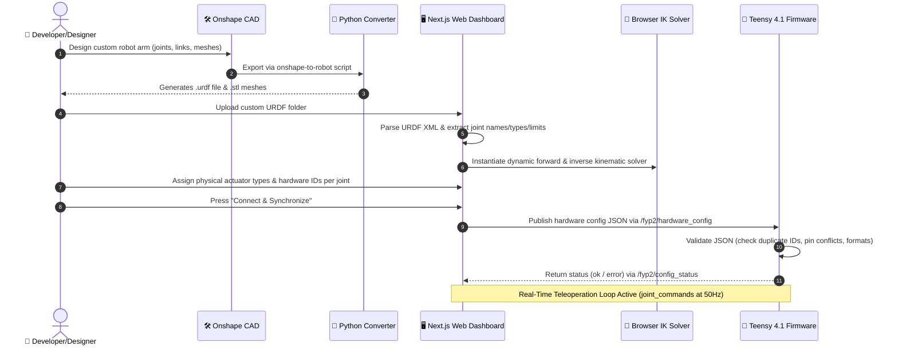

# mod-control-twin: Modular Control System & Digital Twin

Welcome to the public repository for **mod-control-twin**, a unified, modular control architecture and real-time 3D digital twin that bridges the gap between simulated and physical robotic hardware.

This project supports modular robot profiles with dynamically configured joint chains (from compact 3-axis setups to redundant 7+ joint manipulators) without firmware recompilation, controlled directly from a modern browser dashboard.

> [!NOTE]
> **Showcase Repository Notice**
> This repository is a public-facing showcase of the project, configured to protect intellectual property for patent pending status:
> 1. **Firmware**: The polymorphic dynamic actuator allocator source code (`main.cpp`) is replaced with a static 6-axis servo joint driver. The fully-featured dynamic allocator firmware is provided as a pre-compiled binary (`firmware_fyp-teensy41/binaries/firmware.hex`) for direct flashing and execution.
> 2. **Kinematics**: The custom inverse kinematics engine is replaced with a standard, textbook-based CCD (Cyclic Coordinate Descent) solver to protect proprietary optimization algorithms.
> 3. **Reports**: Academic drafts, raw research data logs, and thesis documents are excluded.

## Project Features

1. **Zero-install Web App**: Implemented in Next.js 15, React, and React Three Fiber for instant desktop/mobile access.
2. **Real-time 3D Digital Twin**: Rendered in the browser with continuous state synchronization.
3. **Hardware Agnosticism**: Visually configure and map actuator pins (Smart Servos, Steppers, and PWM Servos) via the browser.
4. **Standard Inverse Kinematics**: Textbook CCD solver running browser-side for smooth joint calculation.
5. **Interactive Teacher Pendant**: Live axis jogging and joint control panel.
6. **micro-ROS Middleware**: Real-time DDS serialization running on a Teensy 4.1 for low-level actuator communication.

## System Architecture

The project runs a 3-layer topology:

```mermaid
%%{init: {'theme': 'neutral', 'themeVariables': { 'fontFamily': 'Fira Code, monospace', 'primaryColor': '#EEF2F6', 'edgeLabelBackground':'#FFFFFF', 'clusterBkg':'#F8FAFC', 'clusterBorder':'#E2E8F0'}}}%%
graph RL
    %% Layer 3: Hardware Layer (Right Side Now)
    subgraph HW["Hardware Layer (Embedded Controller)"]
        direction TB
        Actuators["<b>Hybrid Actuator Stack</b><br/>• Smart Servos (STS3215 TTL Bus)<br/>• Stepper Drivers (NEMA 23/34 Step/Dir)<br/>"]
        Teensy["<b>Teensy 4.1</b><br/><i>ARM Cortex-M7 @ 600MHz</i><br/>• micro-ROS Client Node<br/>• Dynamic Actuator Allocator<br/>• Real-time Kinematic Map"]

        Actuators <-->|"Half-Duplex UART & GPIO"| Teensy
    end

    %% Layer 2: Middleware Layer (Center)
    subgraph MW["Middleware Layer (Host PC / SBC)"]
        direction TB
        MicroROS["<b>micro-ROS Agent</b><br/><i>XRCE-DDS Agent</i><br/>• Serial-DDS Bridge"]
        ROS2["<b>ROS 2 Humble / Jazzy</b><br/><i>Data Distribution Service (DDS)</i><br/>• /joint_commands Topic<br/>• /servo_feedback Topic"]
        ROSBridge["<b>ROSBridge Suite</b><br/><i>WebSocket Server (:9090)</i><br/>• JSON-to-ROS Translation"]

        MicroROS <--> ROS2
        ROS2 <--> ROSBridge
    end

    %% Layer 1: High-Level Layer (Left Side Now)
    subgraph HL["High-Level Layer (Client Browser)"]
        direction TB

        Dashboard["<b>Web Dashboard</b><br/><i>Next.js 15 + React Three Fiber</i><br/>• 3D Digital Twin (Three.js)<br/>• Zustand State Management<br/>• Custom Vector & Matrix Math"]
    end

    %% Inter-layer connections (Flowing right to left)
    Teensy <-->|"<b>High-Speed Serial (USB)</b><br/>• XRCE-DDS Protocol<br/>• Baud: 6,000,000"| MicroROS
    ROSBridge <-->|"<b>WebSocket Protocol (ws://)</b><br/>• hardware_config (JSON)<br/>• joint_commands (Float32)"| HL

    %% Custom styles
    classDef highLevel fill:#e0e7ff,stroke:#6366f1,stroke-width:2px,color:#1e1b4b;
    classDef middleware fill:#fef3c7,stroke:#d97706,stroke-width:2px,color:#451a03;
    classDef hardware fill:#d1fae5,stroke:#059669,stroke-width:2px,color:#064e3b;

    class Dashboard highLevel;
    class ROSBridge,ROS2,MicroROS middleware;
    class Teensy,Actuators hardware;
```

### Modular Assembly Architecture

### URDF Upload & Generation Pipeline

### Methodology & Validation Flowchart

A dedicated dual-track system setup and teleoperation flowchart, alongside solver validation details, is available in **[docs/methodology_flowcharts.md](docs/methodology_flowcharts.md)**. You can easily view, render, and screenshot these methodology flowcharts for inclusion in presentations or documentation.

### The Modular "Assemble" Concept

The core feature of this platform is the `Assemble` tab within the web dashboard. Users can:

- **Configure Actuators:** Select whether a joint is powered by a serial servo, a stepper driver, or a standard PWM servo.
- **Set Limits & IDs:** Calibrate and set boundaries for joint movement.
- **Swap Tool Heads:** Dynamically specify the active end-effector (e.g., standard gripper, rotary drill) and update the 3D viewer instantly.
  The resulting JSON configuration is dynamically sent to the Teensy microcontroller, instantly altering its hardware routing without recompiling firmware.

## Repository Map

- **`src/web_dashboard/`** — The Next.js 15 React application utilizing React Three Fiber and Zustand.
- **`firmware_fyp-teensy41/`** — PlatformIO C++ firmware with the micro-ROS bridge (Showcase edition).
- **`firmware_fyp-teensy41/binaries/`** — Precompiled firmware binary with the full Dynamic Actuator Allocator features.
- **`src/so_arm_description/` & `so_arm_moveit_config/`** — ROS 2 packages containing the generated URDF meshes and MoveIt configurations.
- **`src/` (root scripts)** — Python bridging nodes to connect ROSBridge to the physical hardware topics.

## Quick Start Requirements

- **Node.js** 18+ (for Next.js Web Dashboard)
- **ROS 2 Humble** (Desktop Install)
- **PlatformIO** (for firmware builds)

## Launch Guide

For the exact startup order (what to run first, second, etc), see:

- [docs/launch_runbook.md](docs/launch_runbook.md)
- [docs/MODULAR_ROBOT_DESIGN_GUIDE.md](docs/MODULAR_ROBOT_DESIGN_GUIDE.md)

It includes:

- terminal-by-terminal launch sequence
- health checks
- when to use `bridge.py` vs dashboard-only control
- shutdown and common troubleshooting
- a checklist for designing custom URDF chains, joint names, TCPs, and hardware maps
