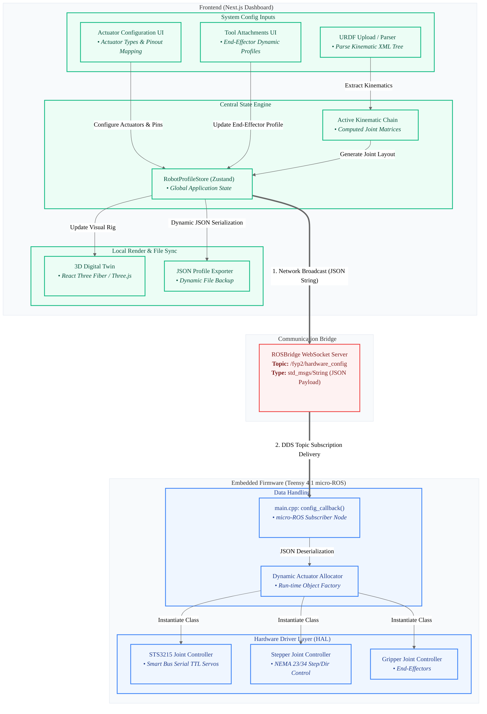
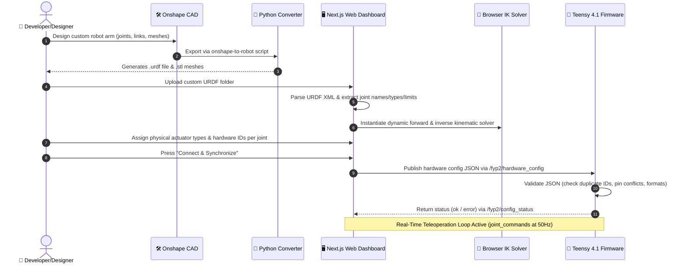
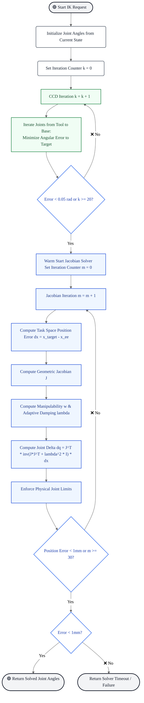

# Robot Control System & Validation Flowcharts

This document compiles the methodology flowcharts and architectural diagrams for the **FYP-SOARM101** project. These diagrams are optimized for rendering in GitHub or any Markdown viewer supporting **Mermaid.js**, making them easy to screenshot and include in your thesis methodology chapter.

---

## 1. System Setup & Teleoperation Flowchart

This flowchart represents the dual-track system setup, network synchronization, configuration verification, and physical control loops. It traces the setup of the robot environment (Raspberry Pi running Docker containers and camera streams) in parallel with the user client side (Next.js web dashboard), merging into the hardware synchronization and active testing loops.

```mermaid
%%{init: {'theme': 'neutral', 'themeVariables': { 'fontFamily': 'Inter, sans-serif', 'primaryColor': '#EEF2F6', 'edgeLabelBackground':'#FFFFFF', 'clusterBkg':'#F8FAFC', 'clusterBorder':'#E2E8F0'}}}%%
graph TD
    %% ==========================================
    %% PARALLEL INITIALIZATION BLOCK
    %% ==========================================
    subgraph Pi["Robot Side: Raspberry Pi Environment Setup"]
        direction TB
        PiStart([Power on Raspberry Pi]) --> ConnectHW["Connect Hardware:<br/>• Teensy 4.1 via USB<br/>• Cameras: USB Cam & Pi Cam"]
        ConnectHW --> RunScript["Run Launch Script:<br/>./launch_raspi_docker.sh"]

        RunScript --> StartDocker["Start Docker Stack:<br/>• Next.js Web App (:3000)<br/>• ROSBridge Server (:9090)<br/>• micro-ROS Agent"]
        RunScript --> StartCams["Start Camera MJPEG Streams:<br/>• Port 8554 (USB Webcam)<br/>• Port 8555 (Pi Camera Module)"]

        StartDocker --> WaitBridge{"Is ROSBridge<br/>Online on Port 9090?"}
        WaitBridge -- "No (Timeout)" --> CheckLogs["Check Docker Logs:<br/>docker compose logs"]
        CheckLogs --> StartDocker

        WaitBridge -- "Yes" --> PiReady[Robot Environment Ready]
    end

    subgraph Client["User Side: Client Browser & Interaction"]
        direction TB
        UserStart([Boot User PC/Device]) --> ConnectNet["Connect to Same Local Network / Tailscale"]
        ConnectNet --> OpenBrowser["Open Web Browser to:<br/>http://&lt;PI_IP&gt;:3000"]
        OpenBrowser --> LoadUI["Web Dashboard Loads:<br/>• Render 3D Digital Twin<br/>• Load Live Camera Streams"]

        LoadUI --> ConfigRobot["Assemble Tab:<br/>• Set Actuator Pin Mapping & Limits<br/>• Select Active Tool Head / Gripper"]
    end

    %% ==========================================
    %% SYNCHRONIZATION & INTERFACES
    %% ==========================================
    PiReady --> ConnectBridge
    ConfigRobot --> ConnectBridge["Press 'Connect & Synchronize'"]

    ConnectBridge --> PublishConfig["Publish Hardware JSON Config<br/>via /fyp2/hardware_config"]

    PublishConfig --> TeensyVerify["Teensy 4.1 Node:<br/>• Deserializes configuration JSON<br/>• Instantiates Actuator Classes<br/>• Verifies hardware pin mapping"]

    %% ==========================================
    %% VALIDATION & RUNTIME RUNTRACK
    %% ==========================================
    TeensyVerify --> ConfigStatus{"Is config_status<br/>'ok'? (No conflicts)"}

    ConfigStatus -- "No" --> AdjustConfig["Adjust Configuration in UI"]
    AdjustConfig --> ConfigRobot

    ConfigStatus -- "Yes" --> TeleopLoop["Active Control Loop:<br/>• Real-time Teleoperation Jogging<br/>• Command Execution via Web UI / LLM<br/>• Stream live camera feedback"]

    TeleopLoop --> Testing["Testing & Data Collection:<br/>• Record joint trajectories<br/>• Validate physical arm positioning<br/>• Log telemetry data"]

    Testing --> EndSession([End Session / Shutdown Stack])

    %% Professional Color Profiles
    classDef startEnd fill:#f1f5f9,stroke:#334155,stroke-width:2px,color:#0f172a;
    classDef piStyle fill:#f0fdf4,stroke:#16a34a,stroke-width:1.5px,color:#14532d,rx:4px;
    classDef clientStyle fill:#eff6ff,stroke:#2563eb,stroke-width:1.5px,color:#1e3a8a,rx:4px;
    classDef errorStyle fill:#fff5f5,stroke:#e53e3e,stroke-width:1.5px,color:#9b2c2c,rx:4px;
    classDef activeStyle fill:#faf5ff,stroke:#7c3aed,stroke-width:1.5px,color:#5b21b6,rx:4px;
    classDef decision fill:#f0f9ff,stroke:#0284c7,stroke-width:1.5px,color:#0369a1;

    class PiStart,UserStart,EndSession startEnd;
    class ConnectHW,RunScript,StartDocker,StartCams,PiReady piStyle;
    class ConnectNet,OpenBrowser,LoadUI,ConfigRobot clientStyle;
    class CheckLogs,AdjustConfig errorStyle;
    class ConnectBridge,PublishConfig,TeensyVerify,Testing,TeleopLoop activeStyle;
    class WaitBridge,ConfigStatus decision;
```

_Note: This process flow shows the parallel setup of the Raspberry Pi embedded environment and the client-side user interface. After network pairing, a config packet is synchronized across the ROSBridge WebSocket channel, validating pin layouts on the Teensy 4.1 node before entering the active teleoperation and validation session._

---

## 2. 3-Layer System Architecture Topology

The system operates across a **High-Level Client Layer**, a **Middleware Communication Layer**, and an **Embedded Hardware Layer**. This diagram maps the physical interfaces and protocol boundaries between the client web browser, host machine/SBC (ROS 2), and Teensy 4.1 microcontroller.

```mermaid
%%{init: {'theme': 'neutral', 'themeVariables': { 'fontFamily': 'Fira Code, monospace', 'primaryColor': '#EEF2F6', 'edgeLabelBackground':'#FFFFFF', 'clusterBkg':'#F8FAFC', 'clusterBorder':'#E2E8F0'}}}%%
graph RL
    %% Layer 3: Hardware Layer (Right Side Now)
    subgraph HW["Hardware Layer (Embedded Controller)"]
        direction TB
        Actuators["<b>Hybrid Actuator Stack</b><br/>• Smart Servos (STS3215 TTL Bus)<br/>• Stepper Drivers (NEMA 23/34 Step/Dir)<br/>"]
        Teensy["<b>Teensy 4.1</b><br/><i>ARM Cortex-M7 @ 600MHz</i><br/>• micro-ROS Client Node<br/>• Dynamic Actuator Allocator<br/>• Real-time Kinematic Map"]

        Actuators <-->|"Half-Duplex UART & GPIO"| Teensy
    end

    %% Layer 2: Middleware Layer (Center)
    subgraph MW["Middleware Layer (Host PC / SBC)"]
        direction TB
        MicroROS["<b>micro-ROS Agent</b><br/><i>XRCE-DDS Agent</i><br/>• Serial-DDS Bridge"]
        ROS2["<b>ROS 2 Humble / Jazzy</b><br/><i>Data Distribution Service (DDS)</i><br/>• /joint_commands Topic<br/>• /servo_feedback Topic"]
        ROSBridge["<b>ROSBridge Suite</b><br/><i>WebSocket Server (:9090)</i><br/>• JSON-to-ROS Translation"]

        MicroROS <--> ROS2
        ROS2 <--> ROSBridge
    end

    %% Layer 1: High-Level Layer (Left Side Now)
    subgraph HL["High-Level Layer (Client Browser)"]
        direction TB

        Dashboard["<b>Web Dashboard</b><br/><i>Next.js 15 + React Three Fiber</i><br/>• 3D Digital Twin (Three.js)<br/>• Zustand State Management<br/>• Custom Vector & Matrix Math"]
    end

    %% Inter-layer connections (Flowing right to left)
    Teensy <-->|"<b>High-Speed Serial (USB)</b><br/>• XRCE-DDS Protocol<br/>• Baud: 6,000,000"| MicroROS
    ROSBridge <-->|"<b>WebSocket Protocol (ws://)</b><br/>• hardware_config (JSON)<br/>• joint_commands (Float32)"| HL

    %% Custom styles test
    classDef highLevel fill:#e0e7ff,stroke:#6366f1,stroke-width:2px,color:#1e1b4b;
    classDef middleware fill:#fef3c7,stroke:#d97706,stroke-width:2px,color:#451a03;
    classDef hardware fill:#d1fae5,stroke:#059669,stroke-width:2px,color:#064e3b;

    class Dashboard highLevel;
    class ROSBridge,ROS2,MicroROS middleware;
    class Teensy,Actuators hardware;
```

---

## 3. Modular Assembly & Actuator Allocation Data Flow

This diagram illustrates how a hardware-agnostic JSON profile configuration, constructed in the Web UI, is routed via ROSBridge to the Teensy 4.1. The firmware then parses the JSON and dynamically instantiates object instances for each motor type (Steppers, Serial Servos, PWM) at runtime.

---

## 4. CAD-to-Teleoperation Pipeline

The process of translating 3D CAD designs (Onshape) into live web-based visualization and real-time physical control involves several coordinate and format conversion steps.

---

## 5. Hybrid Inverse Kinematics Convergence Flowchart (CCD + Jacobian DLS)

This flowchart illustrates the multi-stage convergence pipeline of the hybrid solver: running Cyclic Coordinate Descent (CCD) first for rapid coarse convergence, then warm-starting the Jacobian Damped Least Squares (DLS) solver for sub-millimeter precision.

